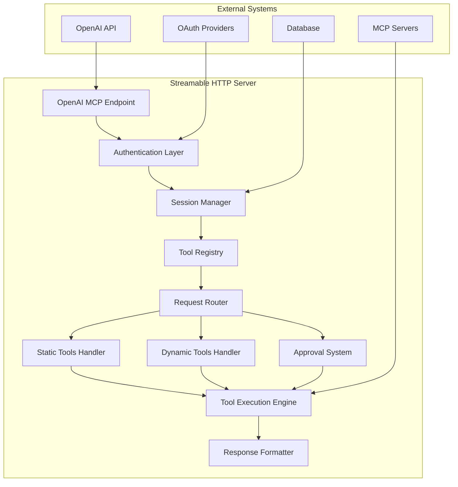
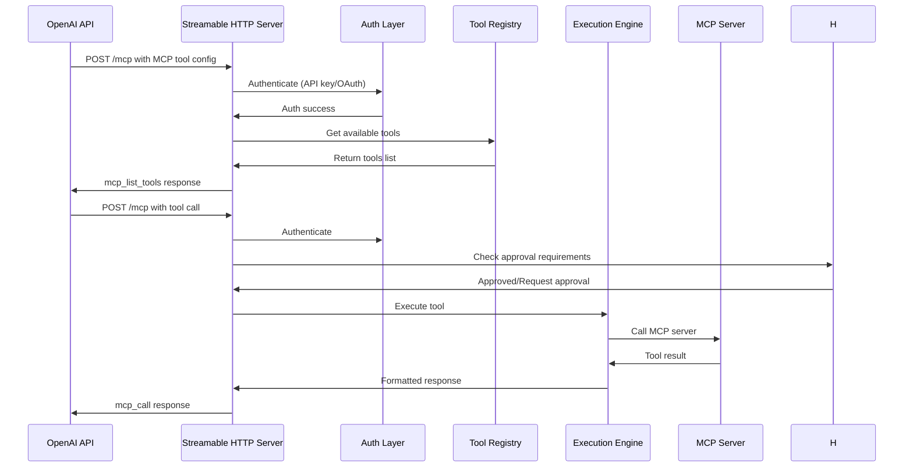

# Streamable HTTP Implementation Plan for OpenAI MCP Integration

## Overview

This document outlines the comprehensive plan for implementing streamable HTTP on pluggedin-app based on OpenAI's guidelines for tools/connectors/MCP, with the same tools as available in pluggedin-mcp.

## Current State Analysis

### Existing pluggedin-app Implementation
- **Location**: `/app/api/mcp/route.ts` and `/lib/mcp/streamable-http/handler.ts`
- **Features**:
  - Basic streamable HTTP endpoint with session management
  - Supports POST (JSON-RPC), GET (SSE), DELETE (session cleanup), OPTIONS (CORS)
  - NextAuth user authentication
  - PostgreSQL-based session persistence
  - Basic tool listing capabilities

### Critical Gaps with OpenAI Guidelines
1. **No OpenAI MCP tool compatibility** - Missing `mcp_list_tools` and `mcp_call` response formats
2. **No static tools system** - Missing `get_tools`, `tool_call`, and other pluggedin-mcp static tools
3. **No API key authentication** - Only uses NextAuth, missing API key support for OpenAI integration
4. **No approval system** - Missing `mcp_approval_request` and `mcp_approval_response` handling
5. **No tool filtering** - Missing `allowed_tools` functionality
6. **No OAuth support for connectors** - Missing connector integration
7. **No stateless mode** - Only supports session-based operation
8. **Limited error handling** - Doesn't match OpenAI MCP error formats

## Architecture Design

### Core Components



### Key Design Principles

#### 1. Dual Authentication Support
- **API Key authentication**: For OpenAI integration
- **OAuth token support**: For connectors (Dropbox, Gmail, Google Calendar, etc.)
- **NextAuth session support**: For web interface

#### 2. Dual Operation Modes
- **Stateful Mode**: Session-based with persistent storage (existing functionality)
- **Stateless Mode**: Request-scoped for simple integrations (new)

#### 3. OpenAI MCP Compatibility
- Support `mcp_list_tools` response format
- Support `mcp_call` response format
- Support `mcp_approval_request/response` flow

#### 4. Tool System Architecture
- **Static Tools**: Built-in tools from pluggedin-mcp
  - `get_tools` - Retrieve available tools
  - `tool_call` - Execute specific tools
  - `pluggedin_setup` - Setup instructions
  - `pluggedin_discover_tools` - Tool discovery
  - `pluggedin_rag_query` - RAG queries
  - `pluggedin_send_notification` - Send notifications
  - `pluggedin_list_notifications` - List notifications
  - `pluggedin_mark_notification_done` - Mark notifications done
  - `pluggedin_delete_notification` - Delete notifications
  - `pluggedin_create_document` - Create documents
  - `pluggedin_list_documents` - List documents
  - `pluggedin_search_documents` - Search documents
  - `pluggedin_get_document` - Get document
  - `pluggedin_update_document` - Update document
- **Dynamic Tools**: MCP server tools discovered at runtime
- **Tool Filtering**: `allowed_tools` support

### API Endpoint Structure

```
/api/streamable-http/mcp
├── POST /mcp (main endpoint - JSON-RPC messages)
├── GET /mcp (SSE stream for server-to-client messages)
├── DELETE /mcp (session cleanup)
├── OPTIONS /mcp (CORS preflight)
└── GET /health (health check)
```

### Request Flow



## Implementation Plan

### Phase 1: Core Server Infrastructure

#### 1.1 Create Streamable HTTP Server (`/lib/mcp/streamable-http/server.ts`)
- Based on pluggedin-mcp's `streamable-http.ts`
- Adapted for Next.js environment (using Next.js API routes instead of Express)
- Support both stateless and stateful modes
- Integration with existing pluggedin-app architecture

**Key Features:**
- Session management with UUID generation
- Transport management (stateless vs stateful)
- CORS headers configuration
- Health check endpoint
- Error handling and logging (integrated with existing Sentry)
- Integration with existing database schema

#### 1.2 Dependencies and Environment Setup
- Check and install required dependencies:
  - `@modelcontextprotocol/sdk` (already in pluggedin-mcp)
  - Ensure compatibility with existing pluggedin-app packages
  - Database migration for new features if needed
- Environment variables configuration
- Integration with existing pluggedin-app configuration patterns

#### 1.2 Enhanced Authentication Layer (`/lib/mcp/streamable-http/auth.ts`)
- API key validation (integrated with existing `authenticateApiKey`)
- OAuth token support
- NextAuth integration (using existing `authOptions`)
- Connector authentication
- Integration with existing pluggedin-app security utilities

**Authentication Methods:**
- `Bearer` API keys for OpenAI integration
- OAuth tokens for connectors
- Session-based authentication for web interface
- Integration with existing user profile system

#### 1.3 Session Management Enhancement (`/lib/mcp/streamable-http/sessions.ts`)
- Extend existing `SessionManager` from `/lib/mcp/sessions/SessionManager`
- Add stateless mode support
- Session cleanup and timeout handling
- Transport lifecycle management
- Integration with existing PostgreSQL session storage
- Type definitions integration with existing `MpcSession` interface

### Phase 2: Tool Registry System

#### 2.1 Tool Registry (`/lib/mcp/streamable-http/tool-registry.ts`)
- Tool discovery and registration
- Static tools management
- Dynamic tools from MCP servers
- Tool filtering capabilities

#### 2.2 Static Tools Implementation (`/lib/mcp/streamable-http/static-tools/`)
Port all static tools from pluggedin-mcp:
- `get-tools.ts` - Tool discovery
- `call-pluggedin-tool.ts` - Tool execution
- `static-tools.ts` - Tool definitions

#### 2.3 Dynamic Tools Integration (`/lib/mcp/streamable-http/dynamic-tools.ts`)
- MCP server tool discovery
- Tool caching and invalidation
- Tool execution proxy

### Phase 3: OpenAI MCP Compatibility

#### 3.1 Response Formatters (`/lib/mcp/streamable-http/formatters.ts`)
- `mcp_list_tools` response format
- `mcp_call` response format
- `mcp_approval_request/response` format
- Error response formatting

#### 3.2 Approval System (`/lib/mcp/streamable-http/approvals.ts`)
- Approval request generation
- Approval response handling
- Approval state management
- Approval workflow integration

#### 3.3 Tool Filtering (`/lib/mcp/streamable-http/filtering.ts`)
- `allowed_tools` implementation
- Tool permission management
- Tool access control

### Phase 4: Enhanced Features

#### 4.1 OAuth Connector Support (`/lib/mcp/streamable-http/connectors/`)
- Connector authentication
- OAuth flow management
- Connector tool integration

**Supported Connectors:**
- Dropbox
- Gmail
- Google Calendar
- Google Drive
- Microsoft Teams
- Outlook Calendar
- Outlook Email
- SharePoint

#### 4.2 Error Handling and Logging (`/lib/mcp/streamable-http/errors.ts`)
- OpenAI MCP error format compliance
- Comprehensive error types
- Structured logging (integrated with existing Sentry setup)
- Error recovery mechanisms
- Integration with pluggedin-app's existing error handling patterns
- Type-safe error definitions

#### 4.3 Health Monitoring (`/lib/mcp/streamable-http/health.ts`)
- Health check endpoints
- Metrics collection
- Performance monitoring
- Status reporting

### Phase 5: API Endpoint Integration

#### 5.1 Main API Route (`/app/api/streamable-http/mcp/route.ts`)
- HTTP method handling (POST, GET, DELETE, OPTIONS)
- Request routing
- Response formatting
- Error handling

#### 5.2 SSE Stream Support (`/app/api/streamable-http/mcp/stream.ts`)
- Server-sent events implementation
- Real-time communication
- Stream management

#### 5.3 Health Check Endpoint (`/app/api/streamable-http/health/route.ts`)
- Health status reporting
- System metrics
- Availability monitoring

## File Structure

```
pluggedin-app/
├── lib/mcp/streamable-http/
│   ├── server.ts                 # Main streamable HTTP server
│   ├── auth.ts                   # Authentication layer
│   ├── sessions.ts               # Session management
│   ├── tool-registry.ts          # Tool registry system
│   ├── formatters.ts             # Response formatters
│   ├── approvals.ts              # Approval system
│   ├── filtering.ts              # Tool filtering
│   ├── connectors/               # OAuth connector support
│   │   ├── oauth-manager.ts
│   │   ├── connector-auth.ts
│   │   └── connector-tools.ts
│   ├── static-tools/             # Static tools implementation
│   │   ├── get-tools.ts
│   │   ├── call-pluggedin-tool.ts
│   │   └── static-tools.ts
│   ├── dynamic-tools.ts          # Dynamic tools integration
│   ├── errors.ts                 # Error handling
│   └── health.ts                 # Health monitoring
├── app/api/streamable-http/
│   ├── mcp/
│   │   ├── route.ts              # Main MCP endpoint
│   │   └── stream.ts             # SSE stream support
│   └── health/
│       └── route.ts              # Health check endpoint
└── docs/
    └── streamable-http-guide.md  # Implementation guide
```

## Implementation Details

### Core Server Implementation

The main server will be based on pluggedin-mcp's `streamable-http.ts` but adapted for Next.js:

```typescript
export interface StreamableHTTPOptions {
  port: number;
  requireApiAuth?: boolean;
  stateless?: boolean;
  enableOAuth?: boolean;
  enableConnectors?: boolean;
}

export async function startStreamableHTTPServer(
  server: Server,
  options: StreamableHTTPOptions
): Promise<() => Promise<void>> {
  // Implementation similar to pluggedin-mcp but adapted for Next.js
}
```

### Authentication System

Multi-layered authentication:

```typescript
export interface AuthContext {
  type: 'api_key' | 'oauth' | 'session';
  apiKey?: string;
  oauthToken?: string;
  session?: Session;
  profileUuid?: string;
  serverLabel?: string;
  connectorId?: string;
}
```

### Tool Registry

Comprehensive tool management:

```typescript
export interface ToolRegistry {
  registerStaticTool(tool: Tool): void;
  registerDynamicTools(serverUuid: string, tools: Tool[]): void;
  getTools(allowedTools?: string[]): Tool[];
  getTool(name: string): Tool | null;
  filterTools(allowedTools: string[]): Tool[];
}
```

### OpenAI MCP Response Formats

#### mcp_list_tools Response
```json
{
  "id": "mcpl_68a6102a4968819c8177b05584dd627b0679e572a900e618",
  "type": "mcp_list_tools",
  "server_label": "dmcp",
  "tools": [
    {
      "annotations": null,
      "description": "Given a string of text describing a dice roll...",
      "input_schema": {
        "$schema": "https://json-schema.org/draft-2020-12/schema",
        "type": "object",
        "properties": {
          "diceRollExpression": {
            "type": "string"
          }
        },
        "required": ["diceRollExpression"],
        "additionalProperties": false
      },
      "name": "roll"
    }
  ]
}
```

#### mcp_call Response
```json
{
  "id": "mcp_68a6102d8948819c9b1490d36d5ffa4a0679e572a900e618",
  "type": "mcp_call",
  "approval_request_id": null,
  "arguments": "{\"diceRollExpression\":\"2d4 + 1\"}",
  "error": null,
  "name": "roll",
  "output": "4",
  "server_label": "dmcp"
}
```

## Testing Strategy

### Unit Tests
- Server functionality tests
- Authentication tests
- Tool registry tests
- Response formatter tests
- Integration with existing pluggedin-app test utilities

### Integration Tests
- End-to-end MCP protocol tests
- OpenAI compatibility tests
- Connector integration tests
- Performance tests
- Database integration tests

### Security Tests
- Authentication bypass tests
- Authorization tests
- Input validation tests
- CORS security tests
- Rate limiting tests

### Testing Framework Integration
- Use existing Vitest setup from pluggedin-app
- Integration with existing test patterns in `tests/` directories
- Mock and fixture integration with existing test utilities
- CI/CD pipeline integration

## Deployment Considerations

### Environment Variables
```bash
# Streamable HTTP Server
STREAMABLE_HTTP_PORT=3001
STREAMABLE_HTTP_STATELESS=false
STREAMABLE_HTTP_REQUIRE_AUTH=true

# Authentication
PLUGGEDIN_API_KEY=your_api_key_here
OPENAI_API_KEY=your_openai_key_here

# OAuth Configuration
OAUTH_CLIENT_ID=your_client_id
OAUTH_CLIENT_SECRET=your_client_secret
OAUTH_REDIRECT_URI=your_redirect_uri

# Connectors
ENABLE_CONNECTORS=true
CONNECTOR_CONFIG_PATH=./config/connectors.json
```

### Performance Considerations
- Session cleanup optimization
- Tool caching strategies
- Connection pooling
- Memory management
- Database query optimization (integration with existing Drizzle ORM)
- Caching integration with existing pluggedin-app caching strategies
- Load balancing considerations for high traffic
- Monitoring and metrics integration

### Security Considerations
- API key validation
- OAuth token security
- CORS configuration
- Rate limiting (integration with existing pluggedin-app rate limiting)
- Input sanitization
- CSRF protection
- Integration with existing pluggedin-app security utilities
- Database query optimization to prevent injection
- Session security enhancements

## Success Criteria

### Functional Requirements
- [ ] Full OpenAI MCP protocol compatibility
- [ ] All pluggedin-mcp static tools available
- [ ] Stateless and stateful mode support
- [ ] API key and OAuth authentication
- [ ] Tool filtering with `allowed_tools`
- [ ] Approval request/response system
- [ ] Connector support for major services
- [ ] Comprehensive error handling

### Performance Requirements
- [ ] Sub-100ms response time for tool listing
- [ ] Sub-500ms response time for tool execution
- [ ] Support for 1000+ concurrent sessions
- [ ] 99.9% uptime for health checks

### Security Requirements
- [ ] Secure API key handling
- [ ] OAuth token validation
- [ ] CORS protection
- [ ] Input validation
- [ ] Rate limiting

## Timeline Estimates

- **Phase 1 (Core Infrastructure)**: 3-4 days
- **Phase 2 (Tool Registry)**: 2-3 days
- **Phase 3 (OpenAI Compatibility)**: 2-3 days
- **Phase 4 (Enhanced Features)**: 3-4 days
- **Phase 5 (API Integration)**: 2-3 days
- **Testing and Documentation**: 2-3 days

**Total Estimated Time**: 14-20 days

## Additional Considerations

### Integration Strategy
- **Enhancement vs Replacement**: The new streamable HTTP implementation should enhance rather than completely replace the existing `/app/api/mcp/route.ts` to maintain backward compatibility
- **Gradual Rollout**: Consider implementing the new endpoints alongside existing ones with feature flags
- **Database Migration**: Assess if new database tables or columns are needed for the enhanced features

### Type Safety and Development Experience
- **Comprehensive TypeScript Types**: Create detailed interfaces for all new components
- **Integration with Existing Types**: Leverage existing types from `@/types/mcp-server.ts` and other type definitions
- **Development Tooling**: Ensure proper IDE support and type checking

### Monitoring and Observability
- **Metrics Collection**: Integrate with existing monitoring systems
- **Performance Tracking**: Add performance metrics for tool execution and response times
- **Error Tracking**: Enhanced error reporting with context

## Next Steps

1. **Review and approve this enhanced implementation plan**
2. **Switch to Code mode to begin implementation**
3. **Start with Phase 1: Core Server Infrastructure**
4. **Proceed with subsequent phases**
5. **Test and validate each phase**
6. **Deploy and monitor the implementation**

This comprehensive plan ensures that pluggedin-app will have a fully compliant OpenAI MCP streamable HTTP implementation with all the tools and capabilities available in pluggedin-mcp, while maintaining seamless integration with the existing codebase architecture.